<div align="center">

# ☁️ AWS 3-Tier Web Application Architecture

### Production-Inspired, Secure, Scalable Cloud Deployment on AWS

*Designed and deployed end-to-end using core AWS networking, compute, database, and IAM services*

[](https://aws.amazon.com/)
[](https://aws.amazon.com/ec2/)
[](https://aws.amazon.com/rds/)
[](https://aws.amazon.com/iam/)
[](https://aws.amazon.com/s3/)
[](https://react.dev/)
[](https://nodejs.org/)
[](https://nginx.org/)
[](https://pm2.keymetrics.io/)
[](https://www.mysql.com/)
[](LICENSE)
[](https://github.com/devanshgoswami02)

</div>

---

## 📖 Overview

This repository documents the design and deployment of a **secure, layered, three-tier web application** on **Amazon Web Services**, built to reflect real-world production architecture patterns used by cloud teams at scale.

The project has evolved from a single-instance proof of concept into a **production-inspired, highly available deployment**. The Web and Application tiers now run on **Auto Scaling Groups** distributed across **two Availability Zones**, fronted by external and internal Application Load Balancers, giving the architecture genuine fault tolerance instead of relying on a single point of failure per tier.

The project separates concerns across a **Web Tier**, **Application Tier**, and **Database Tier**, each isolated within its own subnet and protected by dedicated security groups, load balancers, and IAM permissions — inspired by AWS Well-Architected best practices around **security, reliability, and cost optimization**.

> 💡 **Design Note:** A single NAT Gateway and a single RDS instance are used intentionally to keep AWS costs low for a self-funded learning project, while Auto Scaling Groups on the Web and App tiers demonstrate high-availability patterns without over-provisioning compute.

---

## 🏗️ Architecture Diagram

<p align="center">
  <br>
  <em>🏗 Final Architecture Diagram</em>
</p>

The architecture is split into three isolated layers inside a custom **Amazon VPC**, each now deployed across **two Availability Zones** for high availability:

| Tier | Subnet Type | Components |
|------|-------------|------------|
| 🌐 **Web Tier** | Public Subnets (AZ-A, AZ-B) | Web Auto Scaling Group — EC2 (Nginx reverse proxy + React static build), Launch Template, External ALB |
| ⚙️ **Application Tier** | Private Subnets (AZ-A, AZ-B) | App Auto Scaling Group — EC2 (Node.js + PM2), Launch Template, Internal ALB |
| 🗄️ **Database Tier** | Private Subnets (AZ-A, AZ-B) | Amazon RDS (MySQL), DB Subnet Group across two AZs |

**Traffic flow:**

```
Internet
   │
   ▼
Internet Gateway
   │
   ▼
External Application Load Balancer          (Public Subnets, AZ-A + AZ-B)
   │
   ├──────────────────────┬──────────────────────┐
   ▼                      ▼                      ▼
Web ASG EC2 — AZ-A     Web ASG EC2 — AZ-B     (scales via Launch Template)
(Nginx + React)        (Nginx + React)
   │                      │
   └──────────────────────┴──────────────────────┘
   ▼
Internal Application Load Balancer           (Private Subnets, AZ-A + AZ-B)
   │
   ├──────────────────────┬──────────────────────┐
   ▼                      ▼                      ▼
App ASG EC2 — AZ-A     App ASG EC2 — AZ-B     (scales via Launch Template)
(Node.js + PM2)        (Node.js + PM2)
   │                      │
   └──────────────────────┴──────────────────────┘
   ▼
Amazon RDS (MySQL)                    (DB Subnet Group, Private Subnets AZ-A + AZ-B)
```

Outbound internet access for private-subnet resources (patching, package installs) is handled via a **NAT Gateway**, keeping the App and DB tiers fully unreachable from the public internet.

---

## 🔄 Request Flow

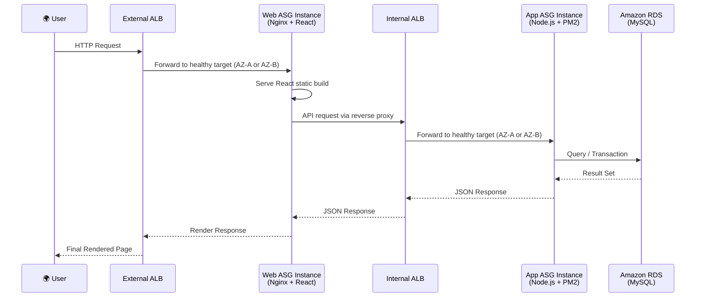

**Architecture flow:** Internet → Internet Gateway → External ALB → Web Auto Scaling Group → Internal ALB → App Auto Scaling Group → Amazon RDS

---

## 🧰 Tech Stack & AWS Services

<div align="center">

| Category | Services / Tools |
|---|---|
| **Networking** | Amazon VPC, Public & Private Subnets (Multi-AZ), Internet Gateway, NAT Gateway, Route Tables, Security Groups |
| **Compute** | Amazon EC2 (Web Tier + App Tier), Auto Scaling Groups (Web & App), Launch Templates (Web & App) |
| **Load Balancing** | Application Load Balancer (External), Application Load Balancer (Internal), Target Groups |
| **Database** | Amazon RDS (MySQL) |
| **Storage** | Amazon S3 |
| **Identity & Security** | IAM Roles, Least-Privilege Policies |
| **Web Server** | Nginx (Reverse Proxy) |
| **Process Management** | PM2 |
| **Backend** | Node.js |
| **Frontend** | React |
| **Version Control** | Git, GitHub |

</div>

---

## ✨ Key Features

- 🔐 **Secure VPC Design** — fully custom VPC with isolated public/private subnet segmentation
- 🧱 **Layered 3-Tier Architecture** — clean separation between presentation, logic, and data
- 🗄️ **Private Database Tier** — RDS MySQL instance with zero public exposure
- ⚖️ **Dual Load Balancer Setup** — external ALB for internet-facing traffic, internal ALB for tier-to-tier traffic
- 🔁 **Reverse Proxy with Nginx** — routes and serves the Web Tier efficiently
- ♻️ **PM2 Process Management** — keeps the Node.js backend alive, auto-restarts on failure
- ⚛️ **React Frontend** — production build served through Nginx
- 🟢 **Node.js Backend** — REST API layer connecting to RDS
- 🪪 **IAM Roles** — scoped, least-privilege access instead of hardcoded credentials
- 🏭 **Production-Inspired Deployment** — architecture mirrors patterns used in real enterprise cloud environments
- 🟢 **High Availability** — Web and App tiers deployed redundantly across two Availability Zones
- 🛡️ **Fault Tolerance** — automatic detection and replacement of unhealthy instances
- 📈 **Auto Scaling** — Web and App Auto Scaling Groups adjust capacity based on demand
- 📋 **Launch Templates** — standardized, version-controlled instance configuration for both tiers
- 🗺️ **Multi-AZ Deployment** — compute and database resources span multiple Availability Zones
- 🌉 **NAT Gateway** — enables secure outbound internet access for private-subnet resources

---

## 🔒 Security Architecture

| Control | Implementation |
|---|---|
| **Private Subnets** | App Tier and DB Tier have no route to the Internet Gateway |
| **Security Groups** | Each tier only accepts traffic from the specific security group of the tier in front of it |
| **IAM Roles** | EC2 instances assume scoped IAM roles instead of storing static AWS credentials |
| **Internal ALB** | Application Tier is only reachable through the internal load balancer, never directly |
| **No Public Database** | RDS MySQL sits in a private subnet with no public accessibility flag enabled |
| **Least Privilege** | IAM policies and security group rules grant only the minimum access required per component |

---

## 🟢 High Availability

The Web and Application tiers are deployed across **two Availability Zones** to eliminate single points of failure at the compute layer:

- **Web Auto Scaling Group** — runs Web Tier EC2 instances (Nginx + React) in both AZ-A and AZ-B, registered behind the **External Application Load Balancer**
- **App Auto Scaling Group** — runs Application Tier EC2 instances (Node.js + PM2) in both AZ-A and AZ-B, registered behind the **Internal Application Load Balancer**
- **Launch Templates** — define a standardized, repeatable configuration (AMI, instance type, user data, security groups) for both the Web and App Auto Scaling Groups
- **External ALB & Internal ALB** — continuously health-check registered targets and route traffic only to instances passing their health checks
- **Automatic Instance Replacement** — if an instance in either Auto Scaling Group fails a health check, the ASG terminates it and launches a replacement from the Launch Template automatically, without manual intervention
- **Multi-AZ Database** — Amazon RDS sits within a DB Subnet Group spanning both Availability Zones

Together, these components mean the loss of a single instance — or an entire Availability Zone — does not take the application offline.

---

## 💰 Cost Optimization

This project balances high-availability design patterns with responsible AWS spend, which matters for a self-funded learning deployment:

- **Single NAT Gateway** — one NAT Gateway is used (rather than one per AZ) as a deliberate cost trade-off for a learning project, accepted as a minor availability compromise
- **t3.micro Instances** — Web and App tier instances run on `t3.micro`, keeping compute costs minimal while still demonstrating Auto Scaling behavior
- **Single RDS Instance** — one RDS (MySQL) instance is used rather than a Multi-AZ RDS deployment, to avoid duplicate database costs during learning and testing
- **Auto Scaling for Demonstration** — ASGs are configured primarily to demonstrate scaling and self-healing behavior, not to handle large-scale production traffic
- **AWS Free Tier Awareness** — instance types and usage were chosen with Free Tier eligibility in mind where possible
- **Resource Cleanup** — EC2 instances, ALBs, NAT Gateways, and RDS instances are torn down after testing sessions to avoid ongoing charges

> ⚠️ **Note:** This project does not guarantee Free Tier eligibility or zero cost — actual charges depend on usage, region, and how long resources remain running. Always verify current pricing and your own Free Tier usage in the AWS Billing Console.

---

## 🚀 Deployment Guide

<details>
<summary><strong>Click to expand full deployment steps</strong></summary>

### Phase 1 — Network Setup
- Create a custom **VPC** with public and private CIDR ranges
- Create **public subnets** (Web Tier, External ALB) and **private subnets** (App Tier, DB Tier)
- Attach an **Internet Gateway** to the VPC
- Deploy a **NAT Gateway** in the public subnet for private-subnet outbound access
- Configure **Route Tables** for public and private subnets separately

### Phase 2 — Security
- Create **Security Groups** for: External ALB, Web Tier, Internal ALB, App Tier, and RDS
- Allow only necessary port/protocol traffic between adjacent tiers
- Create an **IAM Role** with least-privilege permissions and attach it to EC2 instances

### Phase 3 — Storage
- Create an **S3 Bucket** for static assets / build artifacts
- Verify IAM Role permissions against S3 and any other required services

### Phase 4 — Database
- Launch the **Amazon RDS (MySQL)** instance inside the private DB subnet
- Restrict inbound access to the App Tier security group only

### Phase 5 — Compute
- Launch the **App Tier EC2** instance in the private subnet
- Launch the **Web Tier EC2** instance in the public subnet

### Phase 6 — Load Balancing
- Create **Target Groups** for the Web Tier and App Tier
- Create the **Internal ALB** (private subnet, App Tier target group)
- Create the **External ALB** (public subnet, Web Tier target group)
- Attach listeners and health checks to both ALBs

### Phase 7 — Application Deployment
- Install **Node.js** on the App Tier instance, deploy backend code, configure environment variables
- Install **PM2** and start the backend: `pm2 start app.js --name backend`
- Configure PM2 to persist across reboots: `pm2 startup && pm2 save`
- Install **Node.js** on the Web Tier instance, run `npm install` and `npm run build` for the production React build
- Install **Nginx** on the Web Tier instance and deploy the React build to its serving directory
- Configure **Nginx** as a reverse proxy to forward `/api` calls to the Internal ALB

### Phase 8 — Verification
- Confirm target group health checks pass (`healthy` status)
- Access the **External ALB DNS name** in a browser
- Verify end-to-end request flow: Browser → External ALB → Web Tier → Internal ALB → App Tier → RDS

</details>

---

## 🧩 Challenges Faced & Solutions

| # | Challenge | Root Cause | Resolution |
|---|---|---|---|
| 1 | **SSM Agent Offline** | Instance lacked outbound connectivity / IAM permissions for SSM | Verified NAT Gateway routing and attached the correct IAM role with SSM policies |
| 2 | **Node.js Version Issue** | Default repo version was incompatible with dependencies | Installed the required Node.js version via NodeSource setup script |
| 3 | **React Build Failure** | Missing dependencies / memory limits during build | Cleared `node_modules`, reinstalled dependencies, and rebuilt with correct Node version |
| 4 | **ESLint Environment Error** | Build treating ESLint warnings as errors in CI mode | Adjusted environment variables (`CI=false`) before running the build |
| 5 | **NPM Dependency Warnings** | Outdated/deprecated packages in `package.json` | Audited and updated dependencies using `npm audit` and version pinning |
| 6 | **Nginx Configuration** | Incorrect root path and missing reverse proxy block | Rewrote the server block with correct `root`, `location`, and `proxy_pass` directives |
| 7 | **Reverse Proxy Configuration** | API calls failing due to incorrect proxy headers | Added proper `proxy_set_header` directives for host, protocol, and forwarded-for |
| 8 | **PM2 Process Management** | Backend process dying on instance reboot | Configured `pm2 startup` and `pm2 save` to persist the process |
| 9 | **Backend Connectivity** | App Tier unable to reach RDS | Corrected security group inbound rules to allow MySQL port from App Tier SG only |
| 10 | **ALB Health Checks Failing** | Health check path/port mismatch with actual app | Aligned target group health check path and port with the running application |
| 11 | **500 Internal Server Error** | Misconfigured environment variables on App Tier | Debugged via logs (`pm2 logs`), corrected `.env` values, and restarted the process |

---

## 🎓 What I Learned

- Designing and segmenting a custom **VPC** with public/private subnet strategy
- Configuring **EC2** instances across multiple tiers with tier-specific responsibilities
- Applying **IAM Roles** and least-privilege access instead of static credentials
- Deploying and securing **Amazon RDS (MySQL)** in a private subnet
- Architecting **external vs internal Application Load Balancers** for tiered traffic routing
- Configuring **Nginx** as both a static file server and reverse proxy
- Managing Node.js processes reliably in production using **PM2**
- Core **Linux system administration** for EC2 instance management
- Deploying a **React** production build and a **Node.js** backend independently
- Systematic **troubleshooting** using logs, health checks, and security group audits
- Practical application of **cloud security** fundamentals in a real deployment
- Thinking in terms of **production-grade architecture**, not just "make it work" solutions
- Configuring **Auto Scaling Groups** and **Launch Templates** for repeatable, self-healing compute
- Designing for **high availability** and **fault tolerance** across multiple Availability Zones
- Implementing **multi-AZ deployment** patterns for compute and database resources
- Balancing architectural ambition with **cost optimization** in a self-funded environment
- Reasoning about **infrastructure scalability** and where automation adds real value

---

## 🔮 Future Improvements

- [ ] Configure **Amazon Route 53** for custom domain routing
- [ ] Enable **HTTPS** using AWS Certificate Manager (ACM)
- [ ] Integrate **AWS WAF** for application-layer protection
- [ ] Add **Amazon CloudWatch** for monitoring, logging, and alarms
- [ ] Build a **CI/CD pipeline** using GitHub Actions
- [ ] Migrate infrastructure provisioning to **Terraform** (Infrastructure as Code)
- [ ] Containerize the application using **Docker**
- [ ] Explore orchestration with **Amazon EKS** (Kubernetes)

---

## 📁 Repository Structure

```
aws-3-tier-web-application/
├── README.md
├── LICENSE
└── screenshots/
    ├── 01-vpc-resource-map.png
    ├── 02-subnets.png
    ├── 03-internet-gateway.png
    ├── 04-route-tables.png
    ├── 05-security-groups.png
    ├── 06-s3-bucket.png
    ├── 07-iam-role.png
    ├── 08-rds-instance.png
    ├── 09-rds-database.png
    ├── 10-app-tier-ec2.png
    ├── 11-web-tier-ec2.png
    ├── 12-internal-alb.png
    ├── 13-external-alb.png
    ├── 14-target-groups.png
    ├── 15-application-working.png
    ├── 16-architecture-diagram.png
    ├── 19-web-auto-scaling-group.png
    ├── 20-app-auto-scaling-group.png
    ├── 21-auto-scaling-instances.png
    ├── 22-launch-template-web.png
    ├── 23-launch-template-app.png
    ├── 24-resource-map-with-asg.png
    └── 25-nat-gateway.png
```

---

## 🖼️ Screenshot Gallery

| | | |
|---|---|---|
| 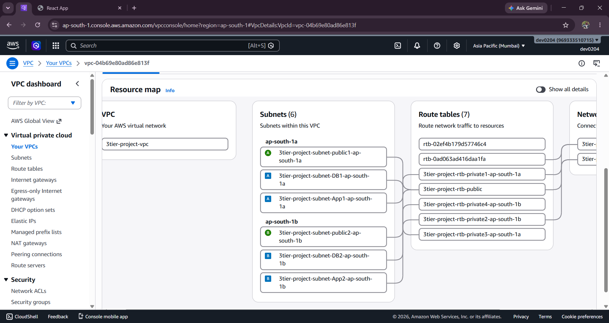 **📍 Custom VPC** | 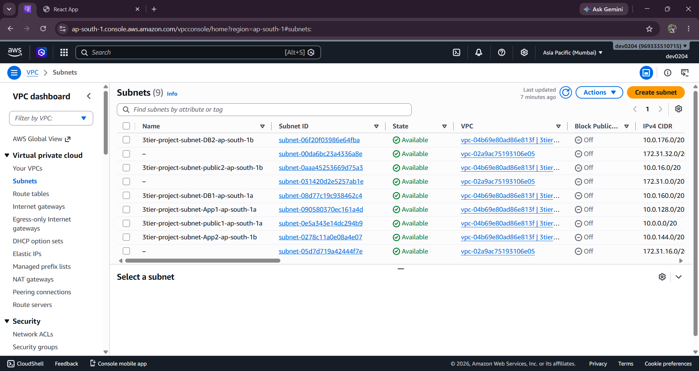 **🌐 Public & Private Subnets** | 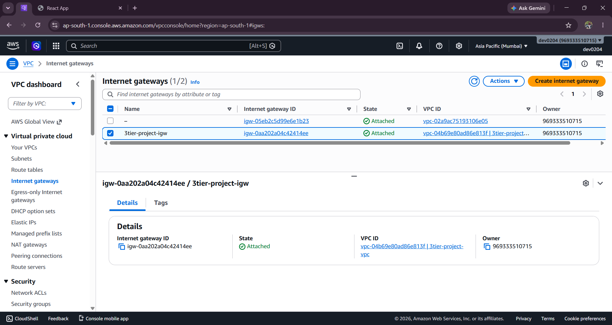 **🛣 Route Tables & Internet Gateway** |
| 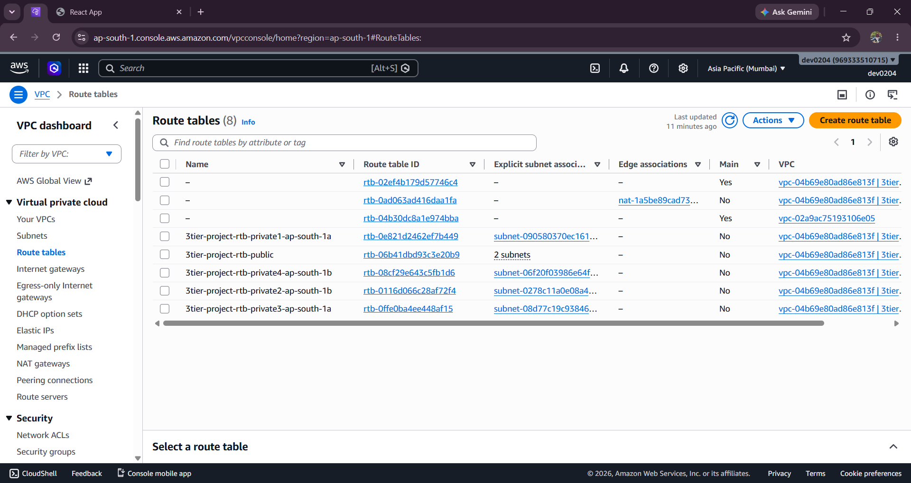 **🛣 Route Tables** | 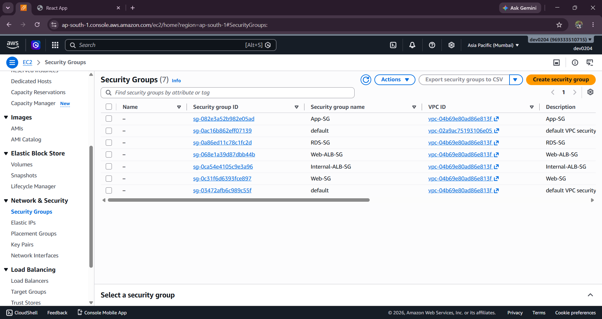 **🔒 Security Groups** | 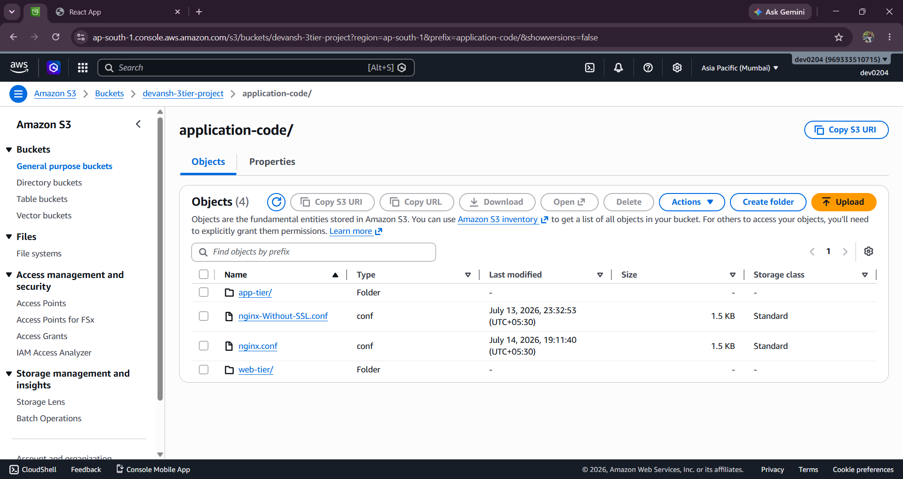 **🪣 Amazon S3 Bucket** |
| 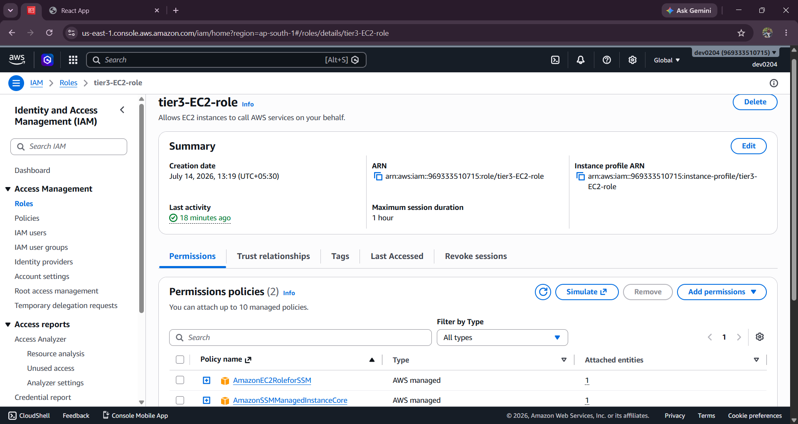 **👤 IAM Role** | 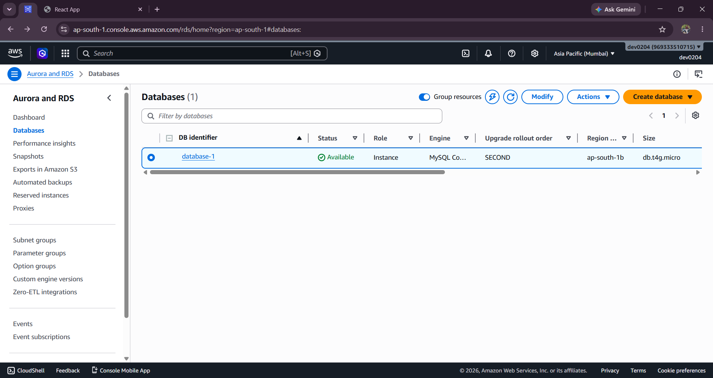 **🗄 Amazon RDS Instance** | 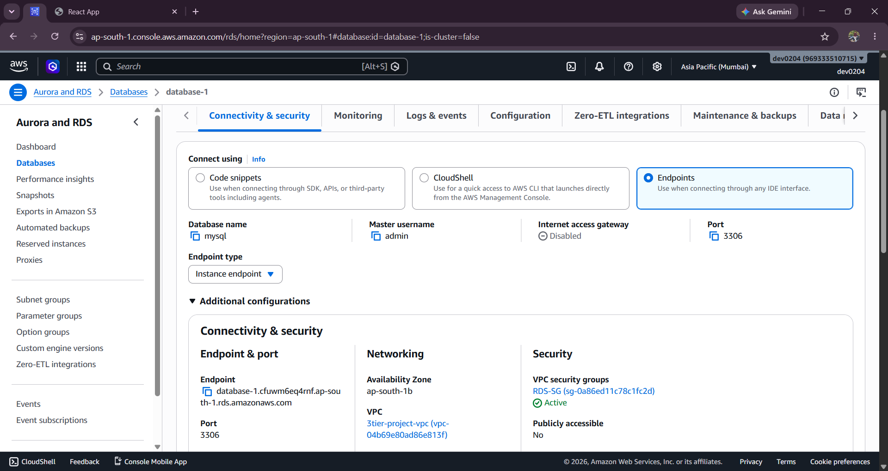 **💾 MySQL Database** |
| 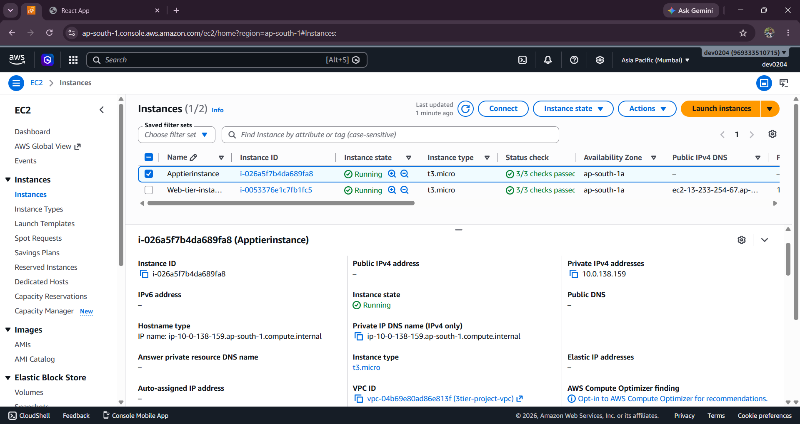 **🖥 Application Tier EC2** | 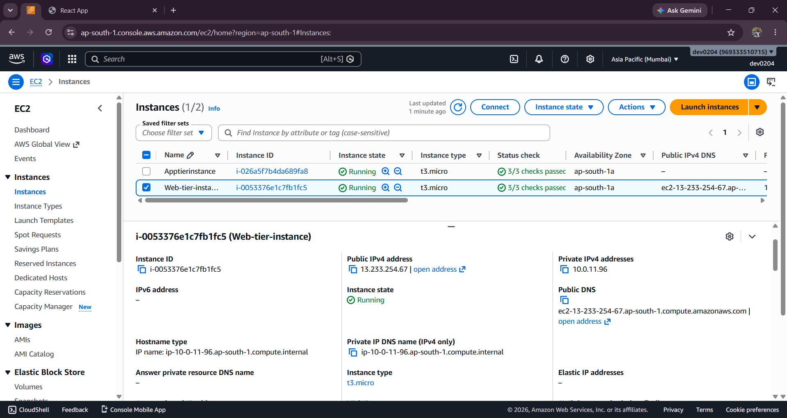 **🌍 Web Tier EC2** | 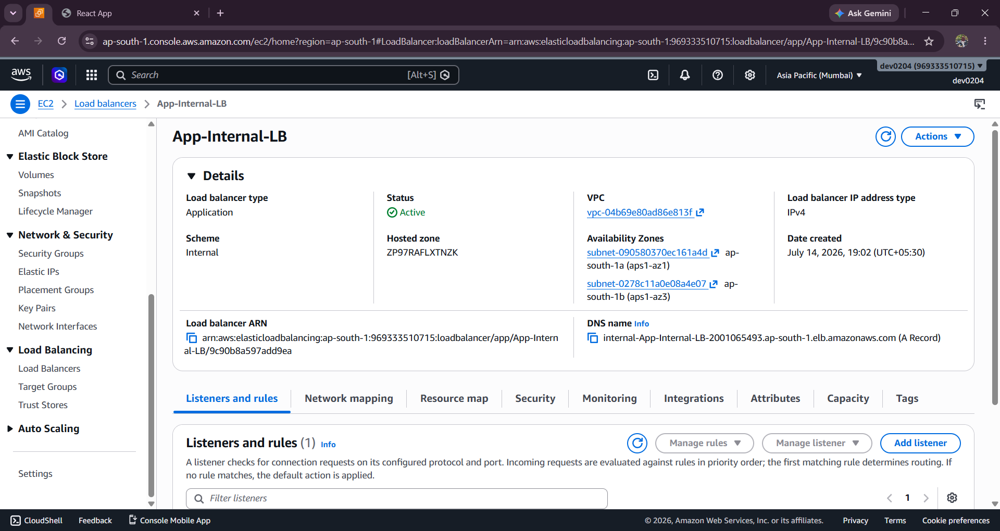 **⚖ Internal Load Balancer** |
| 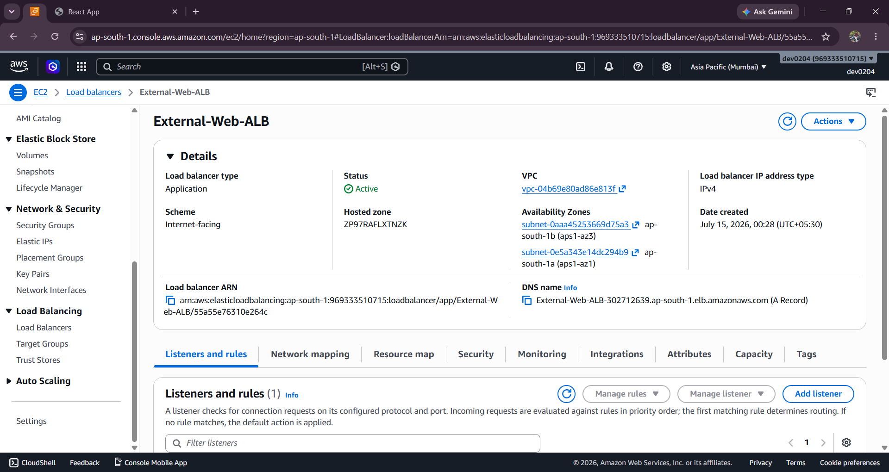 **🌐 External Load Balancer** | 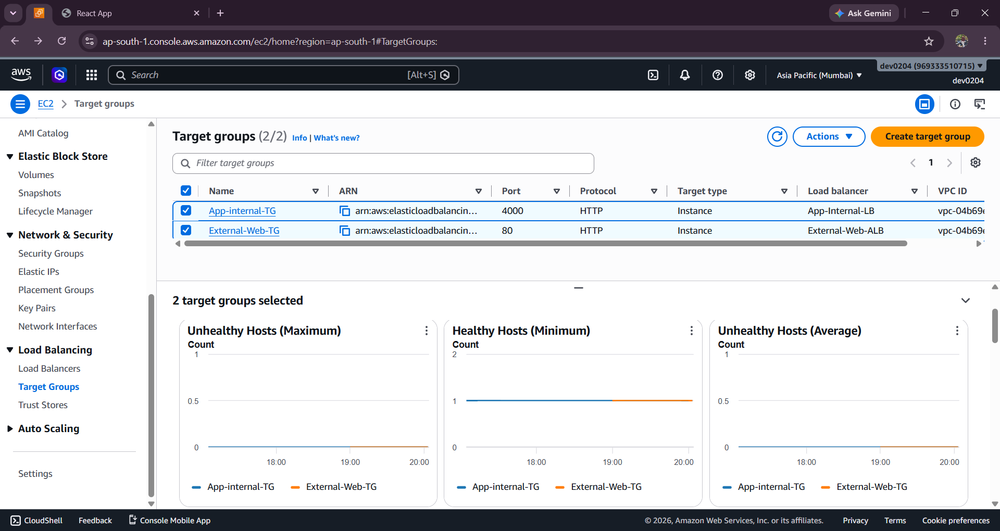 **🎯 Target Groups** |  **🚀 Running Application** |
|  **📈 Web Auto Scaling Group** | 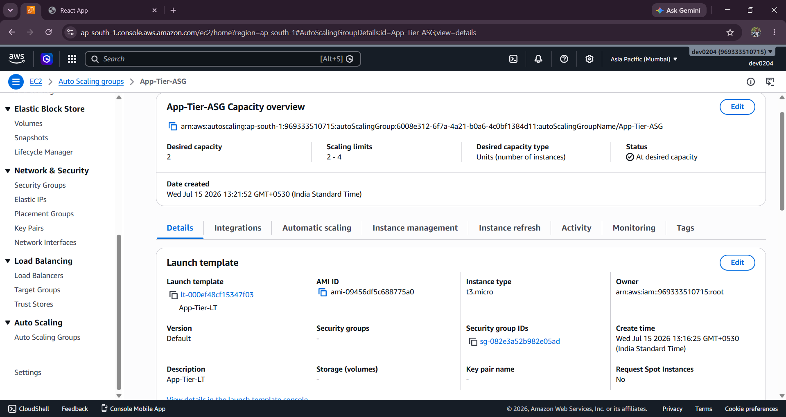 **📈 App Auto Scaling Group** | 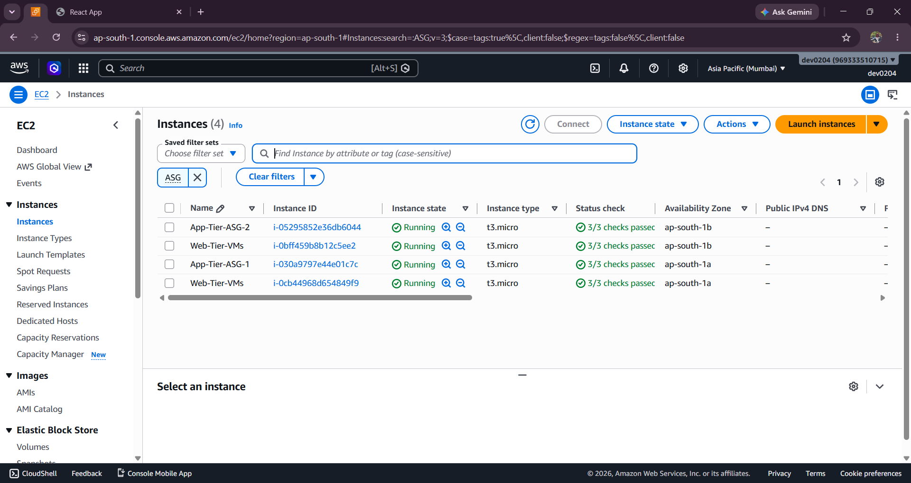 **🖥 Auto Scaling Instances** |
| 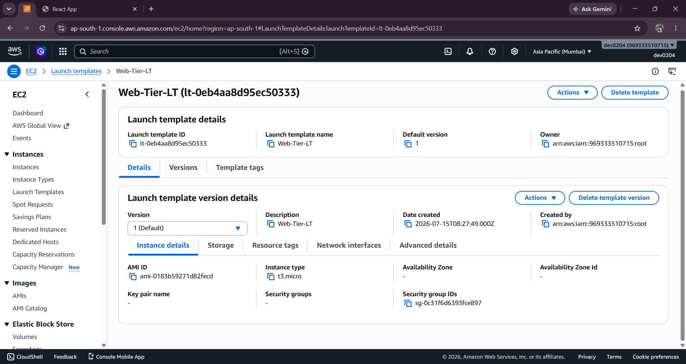 **📋 Launch Template — Web** | 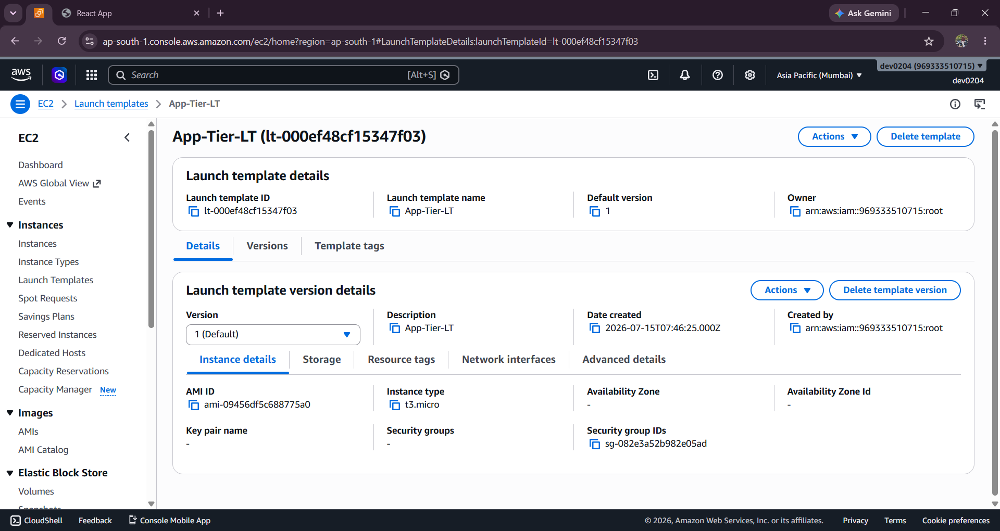 **📋 Launch Template — App** |  **🗺 Resource Map with ASG** |
| 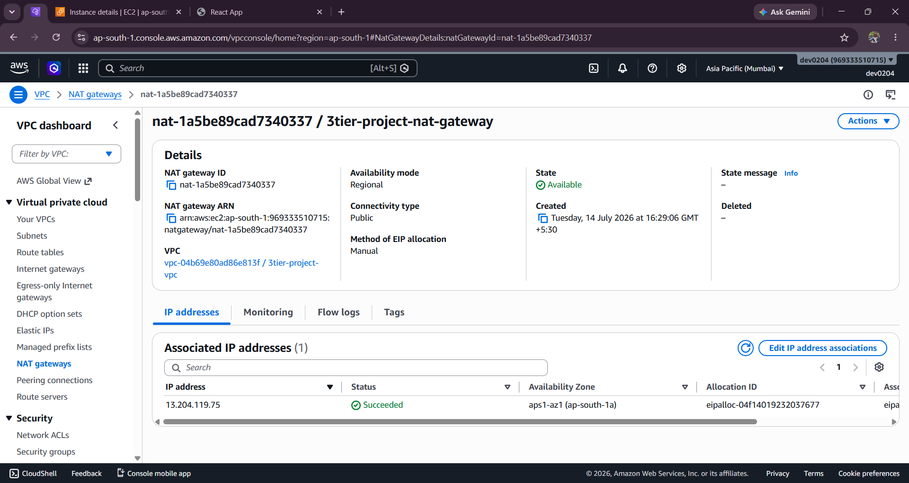 **🌉 NAT Gateway** | | |

> 📌 Replace the images above with your actual exported screenshots — all filenames already match the `screenshots/` folder structure listed in this repo.

---

## 🎯 Skills Demonstrated

<div align="center">

| | | |
|---|---|---|
| AWS Networking | Amazon EC2 | Amazon RDS |
| Amazon S3 | IAM | VPC |
| Application Load Balancer | Linux | Nginx |
| PM2 | Node.js | React |
| Cloud Security | Troubleshooting | System Design |

</div>

---

## 💼 Resume Highlights

✔ Designed a secure AWS VPC with public and private subnets.

✔ Deployed a production-inspired Three-Tier Web Application.

✔ Configured Internal and External Application Load Balancers.

✔ Hosted a React frontend using Nginx.

✔ Managed the Node.js backend using PM2.

✔ Integrated Amazon RDS MySQL.

✔ Implemented IAM Roles and Security Groups.

✔ Troubleshot deployment and networking issues.

---

## 👤 Author

<div align="center">

### **Devansh Goswami**
**Aspiring AWS Cloud Engineer | DevOps Enthusiast**

[](https://github.com/devanshgoswami02)
[](https://linkedin.com/in/devansh-goswami02)
[](mailto:devansh.goswami2004@gmail.com)

</div>

---

<div align="center">

### ⭐ If you found this project useful or insightful, consider giving it a star!

*Built with a focus on real-world cloud architecture, security, and production readiness.*

</div>
